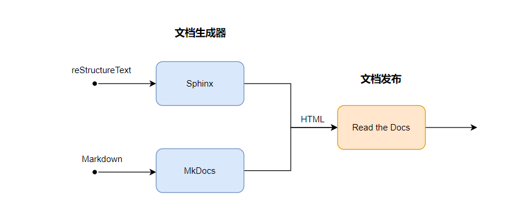
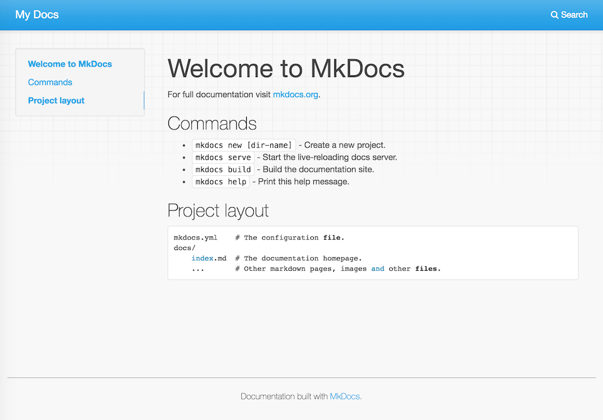
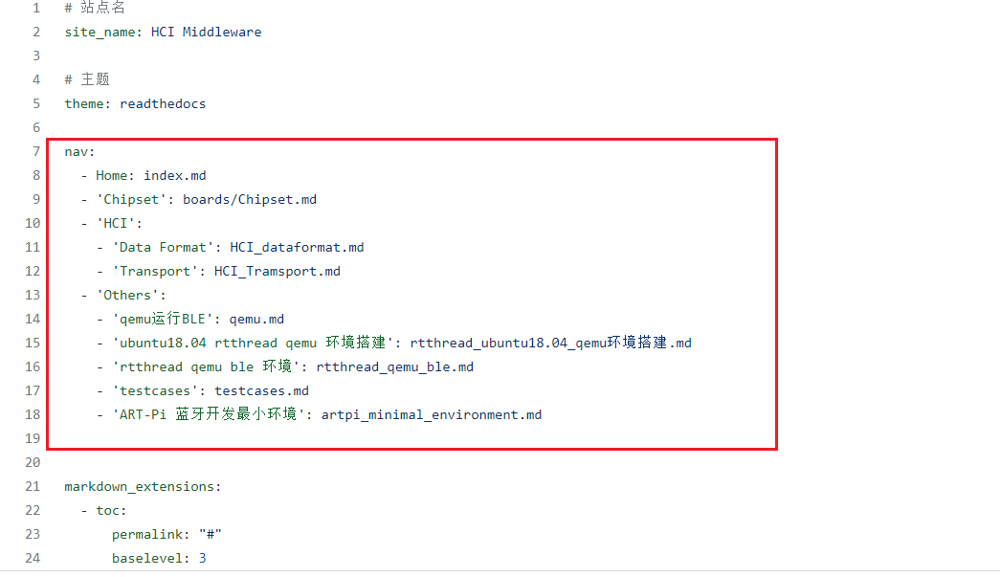
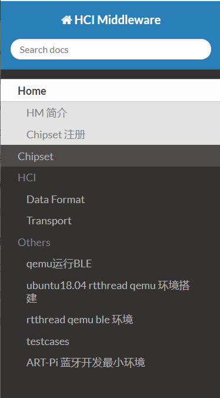
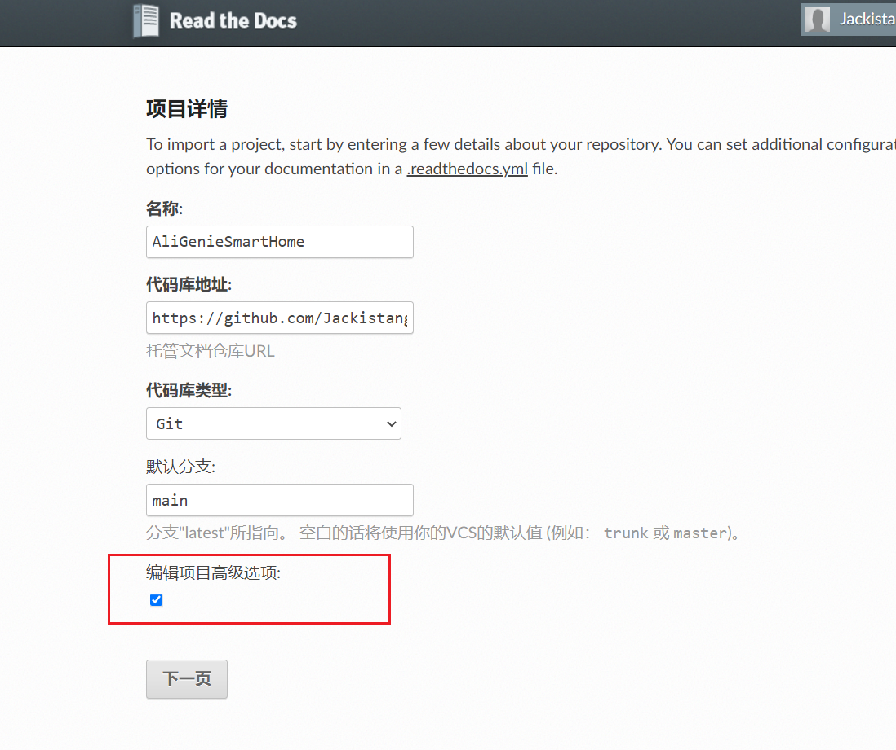
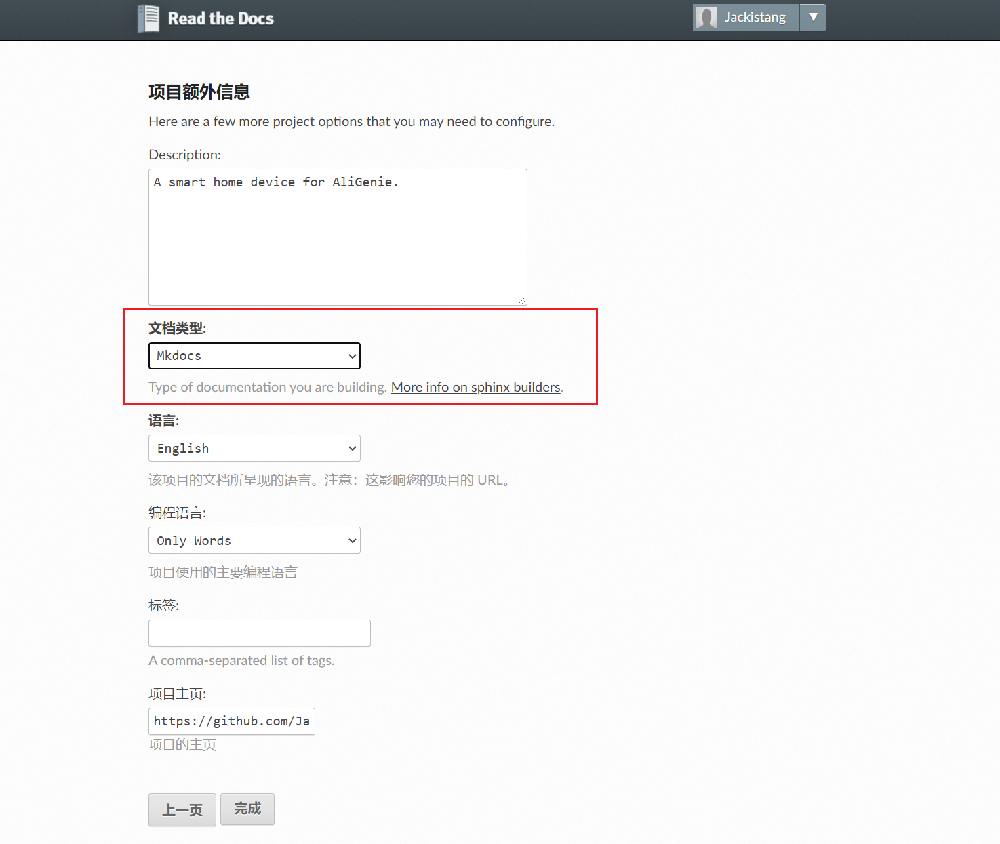

MkDocs + Read the Docs tempalte project.

## 简介

文档生成器用于解析标记语言（rst 和 Markdown），将其输出为 HTML，最后将 HTML 文件托管到一个网站并发布。



Read the Docs 支持两种文档生成器：

- Sphinx：文档生成器，支持生成 html, PDF, ePub 等等，默认支持 reStructureText 语法，使用插件可支持 Markdown 语法。
- MkDocs：文档生成器，默认支持 Markdown 语法，使用难度较低。

以下介绍 MkDocs + Read the Docs 方式搭建文档生成发布环境。

参考了官方文档：

- [Getting Started with MkDocs - Read the Docs](https://docs.readthedocs.io/en/stable/intro/getting-started-with-mkdocs.html)
- [Getting Started - MkDocs](https://www.mkdocs.org/getting-started/)

### MkDocs

首先安装 MkDocs：

```shell
pip install mkdocs
```

然后进入一个测试目录，创建一个 mkdocs 工程，输入

```shell
mkdocs new .
```

这样该目录下就有一个 `mkdocs.yml` 的工程配置文件，`docs/index.md` 文件就是整个文档的入口。然后可以在本地构建文档：

```shell
mkdocs serve
```

 在浏览器打开 http://127.0.0.1:8000/ 即可看到文档构建成功。



`mkdocs.yml` 包含了整个文档的工程配置，以下介绍如何添加新的文档：

`nav` 对象下存储了所有文档，文档存储的默认路径为 `docs` 。





### Read the Docs

Read the Docs 支持文档发布，并且支持自动构建文档，例如我们将文档放置在 GitHub 仓库里，那么该仓库每次有 commit 之后，Read the Docs 都会帮助我们自动构建文档并发布。

首先需要注册一个 Read the Docs 账号，选用 `Sign up with GitHub`，这样就自动完成了 GitHub 对 Read the Docs 的授权。

登录之后就可以点击 `Import a Project` 导入 GitHub 工程了，它会把我们 GitHub 上所有 Reposity 仓库都罗列出来。由于我们使用 MkDocs 作为文档生成器，Read the Docs 会自动识别工程根目录下的 `mkdocs.yml` 文件，并执行文档生成。

需要注意的是，在导入项目时，默认是 Sphinx 生成器，我们需要切换为 MkDocs。勾选“编辑项目高级选项”，



然后“文档类型”这里选择 Mkdocs 就好。



我这里提供了 MkDocs + Read the Docs 文档项目[模板](https://github.com/Jackistang/MkDocs-ReadTheDocs-demo)，GitHub 项目需要搭建文档时直接将相应内容复制一份即可。

